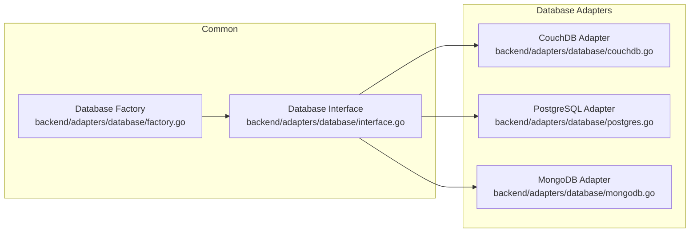
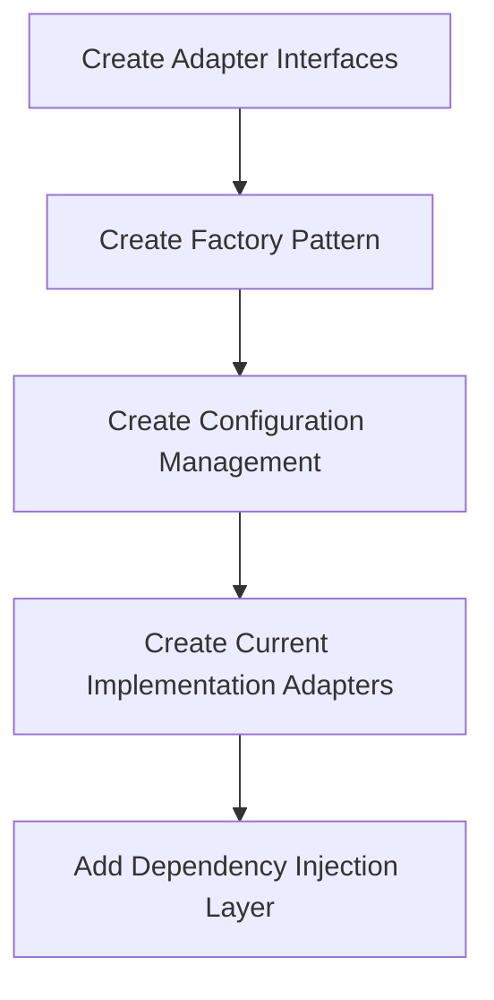
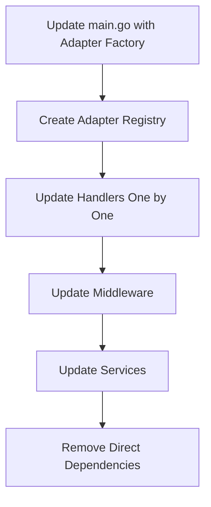
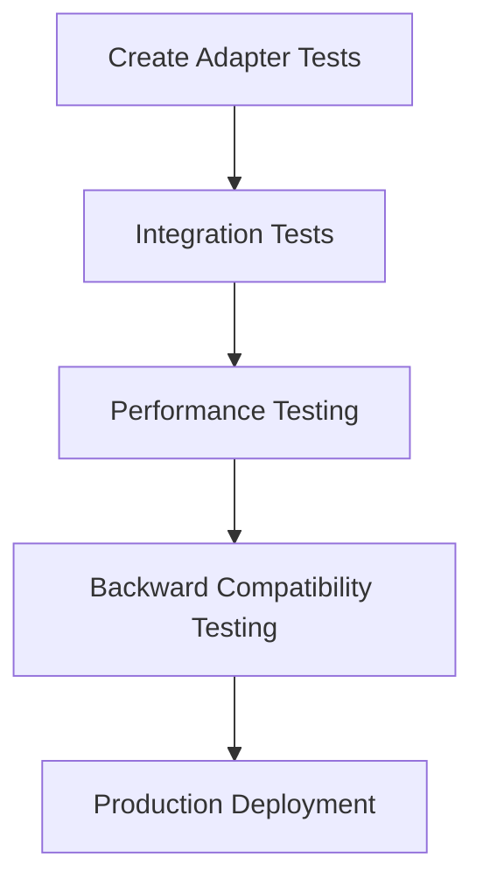

# WebEnable CMS Adapter Pattern Implementation Plan

## Executive Summary

This document outlines a comprehensive architectural plan for implementing the Adapter pattern across the WebEnable CMS codebase to improve modularity, flexibility, and maintainability. The plan addresses five key areas: Database, Cache, Authentication, Email, and File Storage systems.

## Table of Contents

1. [Current Architecture Analysis](#current-architecture-analysis)
2. [Proposed Architecture Overview](#proposed-architecture-overview)
3. [Database Adapter Implementation](#database-adapter-implementation)
4. [Cache Adapter Implementation](#cache-adapter-implementation)
5. [Authentication Adapter Implementation](#authentication-adapter-implementation)
6. [Email Adapter Implementation](#email-adapter-implementation)
7. [File Storage Adapter Implementation](#file-storage-adapter-implementation)
8. [Migration Strategy](#migration-strategy)
9. [Configuration Management](#configuration-management)
10. [Dependency Injection Pattern](#dependency-injection-pattern)
11. [Benefits](#benefits)
12. [Testing Strategy](#testing-strategy)
13. [Implementation Timeline](#implementation-timeline)

## Current Architecture Analysis

### Current Tight Coupling Issues

Based on the codebase analysis, the following tight coupling patterns have been identified:

- **Database**: Direct `database.Instance` calls throughout handlers in `backend/database/database.go:19`
- **Cache**: Direct `ValkeyClient` method calls in handlers and middleware in `backend/cache/valkey.go:14`
- **Authentication**: Hard-coded JWT logic in `backend/middleware/auth.go:18`
- **Email**: Direct SMTP implementation in `backend/services/email.go:11`
- **File Storage**: Not implemented, but `Post.FeaturedImage` field in `backend/models/models.go:19` suggests future need

### Current Dependencies

```
Handlers → database.Instance (CouchDB)
Handlers → cache.ValkeyClient (Valkey/Redis)
Middleware → JWT (golang-jwt/jwt)
Services → gomail (SMTP)
```

## Proposed Architecture Overview

```mermaid
graph TB
    subgraph "Application Layer"
        H[Handlers]
        M[Middleware]
        S[Services]
    end
    
    subgraph "Adapter Layer"
        DI[Database Interface]
        CI[Cache Interface]
        AI[Auth Interface]
        EI[Email Interface]
        FI[File Storage Interface]
    end
    
    subgraph "Implementation Layer"
        subgraph "Database Adapters"
            CD[CouchDB Adapter]
            PG[PostgreSQL Adapter]
            MG[MongoDB Adapter]
        end
        
        subgraph "Cache Adapters"
            VK[Valkey Adapter]
            RD[Redis Adapter]
            MC[Memcached Adapter]
        end
        
        subgraph "Auth Adapters"
            JWT[JWT Adapter]
            OAuth[OAuth2 Adapter]
            SAML[SAML Adapter]
        end
        
        subgraph "Email Adapters"
            SMTP[SMTP Adapter]
            SG[SendGrid Adapter]
            SES[AWS SES Adapter]
        end
        
        subgraph "File Storage Adapters"
            LFS[Local File System]
            S3[AWS S3 Adapter]
            GCS[Google Cloud Storage]
        end
    end
    
    H --> DI
    H --> CI
    M --> AI
    S --> EI
    H --> FI
    
    DI --> CD
    DI --> PG
    DI --> MG
    
    CI --> VK
    CI --> RD
    CI --> MC
    
    AI --> JWT
    AI --> OAuth
    AI --> SAML
    
    EI --> SMTP
    EI --> SG
    EI --> SES
    
    FI --> LFS
    FI --> S3
    FI --> GCS
```



## Database Adapter Implementation

### Interface Design

**File**: `backend/adapters/database/interface.go`

```go
package database

import (
    "webenable-cms-backend/models"
)

type DatabaseAdapter interface {
    // Connection Management
    Connect(config DatabaseConfig) error
    Close() error
    Health() error
    
    // Post Operations
    CreatePost(post *models.Post) error
    GetPost(id string) (*models.Post, error)
    GetPosts(limit, offset int) ([]models.Post, error)
    UpdatePost(id string, post *models.Post) error
    DeletePost(id string) error
    
    // User Operations
    CreateUser(user *models.User) error
    GetUser(id string) (*models.User, error)
    GetUserByUsername(username string) (*models.User, error)
    GetUserByEmail(email string) (*models.User, error)
    GetUsers(limit, offset int) ([]models.User, error)
    UpdateUser(id string, user *models.User) error
    DeleteUser(id string) error
    
    // Contact Operations
    CreateContact(contact *models.Contact) error
    GetContact(id string) (*models.Contact, error)
    GetContacts(limit, offset int) ([]models.Contact, error)
    UpdateContact(id string, contact *models.Contact) error
    DeleteContact(id string) error
    
    // Transaction Support
    BeginTransaction() (Transaction, error)
}

type Transaction interface {
    Commit() error
    Rollback() error
}

type DatabaseConfig struct {
    Type   string                 `json:"type"`
    Config map[string]interface{} `json:"config"`
}
```

### Implementation Strategy



### Migration Path

1. **Current State**: Direct `database.Instance` calls in handlers
2. **Target State**: Handlers use `DatabaseAdapter` interface
3. **Migration Steps**:
   - Create `DatabaseAdapter` interface
   - Implement `CouchDBAdapter` wrapping existing logic
   - Update handlers to accept `DatabaseAdapter` dependency
   - Replace direct `database.Instance` calls with adapter methods

### Benefits

- **Flexibility**: Easy switching between CouchDB, PostgreSQL, MongoDB
- **Testing**: Mock implementations for unit tests
- **Maintainability**: Centralized database logic
- **Scalability**: Support for multiple database backends

### Integration Points

- **Handlers**: `backend/handlers/*.go` - Replace direct database calls
- **Services**: Future database-dependent services
- **Middleware**: Any middleware requiring database access

## Cache Adapter Implementation

### Interface Design

**File**: `backend/adapters/cache/interface.go`

```go
package cache

import (
    "time"
)

type CacheAdapter interface {
    // Basic Operations
    Set(key string, value interface{}, ttl time.Duration) error
    Get(key string, dest interface{}) error
    Delete(key string) error
    Exists(key string) (bool, error)
    
    // Advanced Operations
    SetExpiration(key string, ttl time.Duration) error
    GetTTL(key string) (time.Duration, error)
    IncrementCounter(key string, ttl time.Duration) (int64, error)
    
    // Application-Specific Operations
    SetSession(sessionID string, data interface{}, ttl time.Duration) error
    GetSession(sessionID string, dest interface{}) error
    DeleteSession(sessionID string) error
    
    CachePost(postID string, post interface{}, ttl time.Duration) error
    GetCachedPost(postID string, dest interface{}) error
    InvalidatePostCache(postID string) error
    
    // Rate Limiting
    SetRateLimit(identifier string, limit int, window time.Duration) (bool, error)
    ResetRateLimit(identifier string) error
    
    // Page Caching
    CachePage(cacheKey string, response []byte, contentType string, ttl time.Duration) error
    GetCachedPage(cacheKey string) ([]byte, string, error)
    InvalidatePageCache(pattern string) error
    
    // Health & Stats
    Health() error
    GetStats() (map[string]interface{}, error)
    Close() error
}

type CacheConfig struct {
    Type   string                 `json:"type"`
    Config map[string]interface{} `json:"config"`
}
```

### Implementation Strategy

- **ValkeyAdapter**: Wrap existing `ValkeyClient` functionality
- **RedisAdapter**: Standard Redis implementation
- **MemcachedAdapter**: Memcached implementation
- **InMemoryAdapter**: Local memory cache for development/testing

### Migration Path

1. **Current State**: Direct `ValkeyClient` calls in handlers and middleware
2. **Target State**: Components use `CacheAdapter` interface
3. **Migration Steps**:
   - Create `CacheAdapter` interface
   - Implement `ValkeyAdapter` wrapping existing logic
   - Update handlers and middleware to accept `CacheAdapter` dependency
   - Replace direct `ValkeyClient` calls with adapter methods

### Benefits

- **Flexibility**: Switch between Valkey, Redis, Memcached
- **Testing**: Mock cache for unit tests
- **Performance**: Optimize cache usage per implementation
- **Scalability**: Support for distributed caching

### Integration Points

- **Handlers**: `backend/handlers/*.go` - Replace direct cache calls
- **Middleware**: `backend/middleware/*.go` - Rate limiting, page caching
- **Services**: Session management, temporary data storage

## Authentication Adapter Implementation

### Interface Design

**File**: `backend/adapters/auth/interface.go`

```go
package auth

import (
    "time"
)

type AuthAdapter interface {
    // Token Operations
    GenerateToken(claims AuthClaims) (string, error)
    ValidateToken(token string) (*AuthClaims, error)
    RefreshToken(token string) (string, error)
    RevokeToken(token string) error
    
    // User Authentication
    AuthenticateUser(credentials AuthCredentials) (*AuthResult, error)
    
    // Claims Management
    ExtractClaims(token string) (*AuthClaims, error)
    
    // Configuration
    Configure(config AuthConfig) error
}

type AuthClaims struct {
    UserID    string                 `json:"user_id"`
    Username  string                 `json:"username"`
    Role      string                 `json:"role"`
    Email     string                 `json:"email"`
    IssuedAt  time.Time              `json:"issued_at"`
    ExpiresAt time.Time              `json:"expires_at"`
    Custom    map[string]interface{} `json:"custom"`
}

type AuthCredentials struct {
    Username string `json:"username"`
    Password string `json:"password"`
    Email    string `json:"email"`
    Token    string `json:"token"`
}

type AuthResult struct {
    Token        string      `json:"token"`
    RefreshToken string      `json:"refresh_token"`
    User         interface{} `json:"user"`
    ExpiresAt    time.Time   `json:"expires_at"`
}

type AuthConfig struct {
    Type   string                 `json:"type"`
    Config map[string]interface{} `json:"config"`
}
```

### Implementation Strategy

- **JWTAdapter**: Wrap existing JWT logic from `backend/middleware/auth.go`
- **OAuth2Adapter**: OAuth2 provider integration
- **SAMLAdapter**: SAML authentication support
- **BasicAuthAdapter**: Basic authentication for development

### Migration Path

1. **Current State**: Hard-coded JWT logic in middleware
2. **Target State**: Middleware uses `AuthAdapter` interface
3. **Migration Steps**:
   - Create `AuthAdapter` interface
   - Implement `JWTAdapter` wrapping existing logic
   - Update middleware to accept `AuthAdapter` dependency
   - Replace direct JWT calls with adapter methods

### Benefits

- **Flexibility**: Support multiple authentication providers
- **Security**: Centralized authentication logic
- **Maintainability**: Easier to update authentication methods
- **Integration**: Easy third-party auth provider integration

### Integration Points

- **Middleware**: `backend/middleware/auth.go` - Replace direct JWT calls
- **Handlers**: `backend/handlers/auth.go` - Login/logout functionality
- **Services**: Any service requiring authentication

## Email Adapter Implementation

### Interface Design

**File**: `backend/adapters/email/interface.go`

```go
package email

import (
    "io"
)

type EmailAdapter interface {
    // Configuration
    Configure(config EmailConfig) error
    
    // Send Operations
    SendEmail(message EmailMessage) error
    SendReply(to, toName, subject, message, originalSubject, originalMessage string) error
    SendTemplatedEmail(template string, data interface{}, to []string) error
    
    // Health Check
    Health() error
    IsConfigured() bool
}

type EmailMessage struct {
    To          []string          `json:"to"`
    CC          []string          `json:"cc"`
    BCC         []string          `json:"bcc"`
    Subject     string            `json:"subject"`
    Body        string            `json:"body"`
    HTMLBody    string            `json:"html_body"`
    Attachments []EmailAttachment `json:"attachments"`
}

type EmailAttachment struct {
    Filename    string    `json:"filename"`
    Content     io.Reader `json:"-"`
    ContentType string    `json:"content_type"`
    Size        int64     `json:"size"`
}

type EmailConfig struct {
    Type   string                 `json:"type"`
    Config map[string]interface{} `json:"config"`
}
```

### Implementation Strategy

- **SMTPAdapter**: Wrap existing SMTP logic from `backend/services/email.go`
- **SendGridAdapter**: SendGrid API integration
- **SESAdapter**: AWS SES integration
- **MailgunAdapter**: Mailgun API integration

### Migration Path

1. **Current State**: Direct SMTP calls in services
2. **Target State**: Services use `EmailAdapter` interface
3. **Migration Steps**:
   - Create `EmailAdapter` interface
   - Implement `SMTPAdapter` wrapping existing logic
   - Update services to accept `EmailAdapter` dependency
   - Replace direct SMTP calls with adapter methods

### Benefits

- **Flexibility**: Switch between SMTP, SendGrid, AWS SES
- **Reliability**: Fallback email providers
- **Features**: Template support, advanced email features
- **Testing**: Mock email sending for tests

### Integration Points

- **Services**: `backend/services/email.go` - Replace direct SMTP calls
- **Handlers**: `backend/handlers/contact.go` - Contact form email replies
- **Notifications**: Future notification system

## File Storage Adapter Implementation

### Interface Design

**File**: `backend/adapters/storage/interface.go`

```go
package storage

import (
    "io"
    "time"
)

type StorageAdapter interface {
    // File Operations
    Upload(file StorageFile) (*StorageResult, error)
    Download(path string) (*StorageFile, error)
    Delete(path string) error
    Exists(path string) (bool, error)
    
    // Directory Operations
    CreateDirectory(path string) error
    ListFiles(path string) ([]StorageInfo, error)
    
    // Metadata Operations
    GetMetadata(path string) (*StorageMetadata, error)
    SetMetadata(path string, metadata map[string]string) error
    
    // URL Operations
    GetPublicURL(path string) (string, error)
    GetSignedURL(path string, expiration time.Duration) (string, error)
    
    // Configuration
    Configure(config StorageConfig) error
    Health() error
}

type StorageFile struct {
    Path        string            `json:"path"`
    Content     io.Reader         `json:"-"`
    ContentType string            `json:"content_type"`
    Size        int64             `json:"size"`
    Metadata    map[string]string `json:"metadata"`
}

type StorageResult struct {
    Path      string            `json:"path"`
    URL       string            `json:"url"`
    Size      int64             `json:"size"`
    Metadata  map[string]string `json:"metadata"`
    UploadedAt time.Time        `json:"uploaded_at"`
}

type StorageInfo struct {
    Path         string            `json:"path"`
    Size         int64             `json:"size"`
    ContentType  string            `json:"content_type"`
    ModifiedAt   time.Time         `json:"modified_at"`
    Metadata     map[string]string `json:"metadata"`
    IsDirectory  bool              `json:"is_directory"`
}

type StorageMetadata struct {
    ContentType string            `json:"content_type"`
    Size        int64             `json:"size"`
    ModifiedAt  time.Time         `json:"modified_at"`
    Custom      map[string]string `json:"custom"`
}

type StorageConfig struct {
    Type   string                 `json:"type"`
    Config map[string]interface{} `json:"config"`
}
```

### Implementation Strategy

- **LocalFileSystemAdapter**: Local file system storage
- **S3Adapter**: AWS S3 integration
- **GCSAdapter**: Google Cloud Storage integration
- **AzureBlobAdapter**: Azure Blob Storage integration

### Migration Path

1. **Current State**: No file storage implementation
2. **Target State**: Handlers use `StorageAdapter` interface for file operations
3. **Migration Steps**:
   - Create `StorageAdapter` interface
   - Implement `LocalFileSystemAdapter` as default
   - Add file upload endpoints to handlers
   - Update `Post` model to use storage adapter for featured images

### Benefits

- **Flexibility**: Switch between local, S3, GCS, Azure
- **Scalability**: Cloud storage integration
- **Features**: Metadata, signed URLs, public URLs
- **Security**: Controlled file access

### Integration Points

- **Handlers**: New file upload/download endpoints
- **Models**: `backend/models/models.go` - Update `Post.FeaturedImage` handling
- **Frontend**: File upload components

## Migration Strategy

### Phase 1: Interface Creation and Factory Setup



**Week 1-2 Tasks:**
- Create all adapter interfaces
- Implement factory pattern for adapter creation
- Set up configuration management system
- Create adapters for current implementations (CouchDB, Valkey, JWT, SMTP, Local)

### Phase 2: Gradual Migration



**Week 3-4 Tasks:**
- Update `main.go` to use adapter factory
- Create service container for dependency injection
- Migrate handlers one by one to use adapters
- Update middleware to use auth and cache adapters
- Update services to use email adapter

### Phase 3: Testing and Validation



**Week 5-6 Tasks:**
- Comprehensive unit tests for all adapters
- Integration tests with real implementations
- Performance benchmarking
- Backward compatibility verification
- Production deployment preparation

## Configuration Management

### Centralized Configuration

**File**: `backend/config/adapters.go`

```go
package config

type AdapterConfig struct {
    Database DatabaseAdapterConfig `json:"database"`
    Cache    CacheAdapterConfig    `json:"cache"`
    Auth     AuthAdapterConfig     `json:"auth"`
    Email    EmailAdapterConfig    `json:"email"`
    Storage  StorageAdapterConfig  `json:"storage"`
}

type DatabaseAdapterConfig struct {
    Type   string                 `json:"type"`   // "couchdb", "postgres", "mongodb"
    Config map[string]interface{} `json:"config"`
}

type CacheAdapterConfig struct {
    Type   string                 `json:"type"`   // "valkey", "redis", "memcached"
    Config map[string]interface{} `json:"config"`
}

type AuthAdapterConfig struct {
    Type   string                 `json:"type"`   // "jwt", "oauth2", "saml"
    Config map[string]interface{} `json:"config"`
}

type EmailAdapterConfig struct {
    Type   string                 `json:"type"`   // "smtp", "sendgrid", "ses"
    Config map[string]interface{} `json:"config"`
}

type StorageAdapterConfig struct {
    Type   string                 `json:"type"`   // "local", "s3", "gcs"
    Config map[string]interface{} `json:"config"`
}
```

### Environment-Based Selection

**Development Environment** (`.env.development`):
```env
DATABASE_ADAPTER=couchdb
CACHE_ADAPTER=valkey
AUTH_ADAPTER=jwt
EMAIL_ADAPTER=smtp
STORAGE_ADAPTER=local
```

**Production Environment** (`.env.production`):
```env
DATABASE_ADAPTER=couchdb
CACHE_ADAPTER=valkey
AUTH_ADAPTER=jwt
EMAIL_ADAPTER=sendgrid
STORAGE_ADAPTER=s3
```

### Adapter Factory Pattern

**File**: `backend/adapters/factory.go`

```go
package adapters

import (
    "fmt"
    "webenable-cms-backend/config"
    "webenable-cms-backend/adapters/database"
    "webenable-cms-backend/adapters/cache"
    "webenable-cms-backend/adapters/auth"
    "webenable-cms-backend/adapters/email"
    "webenable-cms-backend/adapters/storage"
)

type AdapterFactory struct {
    config *config.AdapterConfig
}

func NewAdapterFactory(config *config.AdapterConfig) *AdapterFactory {
    return &AdapterFactory{config: config}
}

func (f *AdapterFactory) CreateDatabaseAdapter() (database.DatabaseAdapter, error) {
    switch f.config.Database.Type {
    case "couchdb":
        return database.NewCouchDBAdapter(f.config.Database.Config)
    case "postgres":
        return database.NewPostgresAdapter(f.config.Database.Config)
    case "mongodb":
        return database.NewMongoDBAdapter(f.config.Database.Config)
    default:
        return nil, fmt.Errorf("unsupported database adapter: %s", f.config.Database.Type)
    }
}

func (f *AdapterFactory) CreateCacheAdapter() (cache.CacheAdapter, error) {
    switch f.config.Cache.Type {
    case "valkey":
        return cache.NewValkeyAdapter(f.config.Cache.Config)
    case "redis":
        return cache.NewRedisAdapter(f.config.Cache.Config)
    case "memcached":
        return cache.NewMemcachedAdapter(f.config.Cache.Config)
    default:
        return nil, fmt.Errorf("unsupported cache adapter: %s", f.config.Cache.Type)
    }
}

// Similar methods for other adapters...
```

## Dependency Injection Pattern

### Service Container

**File**: `backend/container/container.go`

```go
package container

import (
    "webenable-cms-backend/adapters"
    "webenable-cms-backend/adapters/database"
    "webenable-cms-backend/adapters/cache"
    "webenable-cms-backend/adapters/auth"
    "webenable-cms-backend/adapters/email"
    "webenable-cms-backend/adapters/storage"
    "webenable-cms-backend/config"
)

type Container struct {
    database database.DatabaseAdapter
    cache    cache.CacheAdapter
    auth     auth.AuthAdapter
    email    email.EmailAdapter
    storage  storage.StorageAdapter
}

func NewContainer(config *config.AdapterConfig) (*Container, error) {
    factory := adapters.NewAdapterFactory(config)
    
    // Initialize all adapters
    db, err := factory.CreateDatabaseAdapter()
    if err != nil {
        return nil, err
    }
    
    cache, err := factory.CreateCacheAdapter()
    if err != nil {
        return nil, err
    }
    
    auth, err := factory.CreateAuthAdapter()
    if err != nil {
        return nil, err
    }
    
    email, err := factory.CreateEmailAdapter()
    if err != nil {
        return nil, err
    }
    
    storage, err := factory.CreateStorageAdapter()
    if err != nil {
        return nil, err
    }
    
    return &Container{
        database: db,
        cache:    cache,
        auth:     auth,
        email:    email,
        storage:  storage,
    }, nil
}

func (c *Container) Database() database.DatabaseAdapter {
    return c.database
}

func (c *Container) Cache() cache.CacheAdapter {
    return c.cache
}

func (c *Container) Auth() auth.AuthAdapter {
    return c.auth
}

func (c *Container) Email() email.EmailAdapter {
    return c.email
}

func (c *Container) Storage() storage.StorageAdapter {
    return c.storage
}

func (c *Container) Close() error {
    // Close all adapters
    if err := c.database.Close(); err != nil {
        return err
    }
    if err := c.cache.Close(); err != nil {
        return err
    }
    // Close other adapters...
    return nil
}
```

### Handler Updates

**File**: `backend/handlers/posts.go` (Updated)

```go
package handlers

import (
    "webenable-cms-backend/adapters/database"
    "webenable-cms-backend/adapters/cache"
    "webenable-cms-backend/adapters/storage"
    "webenable-cms-backend/container"
)

type PostHandler struct {
    db      database.DatabaseAdapter
    cache   cache.CacheAdapter
    storage storage.StorageAdapter
}

func NewPostHandler(container *container.Container) *PostHandler {
    return &PostHandler{
        db:      container.Database(),
        cache:   container.Cache(),
        storage: container.Storage(),
    }
}

func (h *PostHandler) GetPosts(w http.ResponseWriter, r *http.Request) {
    // Use h.db instead of database.Instance
    posts, err := h.db.GetPosts(limit, offset)
    if err != nil {
        http.Error(w, err.Error(), http.StatusInternalServerError)
        return
    }
    
    // Use h.cache for caching
    cacheKey := fmt.Sprintf("posts:%d:%d", limit, offset)
    if err := h.cache.Set(cacheKey, posts, 10*time.Minute); err != nil {
        // Log error but don't fail the request
        log.Printf("Failed to cache posts: %v", err)
    }
    
    // Return response...
}
```

### Updated main.go

**File**: `backend/main.go` (Updated)

```go
package main

import (
    "webenable-cms-backend/config"
    "webenable-cms-backend/container"
    "webenable-cms-backend/handlers"
)

func main() {
    // Initialize configuration
    config.Init()
    
    // Create service container
    container, err := container.NewContainer(&config.AppConfig.Adapters)
    if err != nil {
        log.Fatal("Failed to create container:", err)
    }
    defer container.Close()
    
    // Initialize handlers with container
    postHandler := handlers.NewPostHandler(container)
    userHandler := handlers.NewUserHandler(container)
    contactHandler := handlers.NewContactHandler(container)
    
    // Setup routes
    r := mux.NewRouter()
    
    // Setup routes using handlers
    api := r.PathPrefix("/api").Subrouter()
    api.HandleFunc("/posts", postHandler.GetPosts).Methods("GET")
    api.HandleFunc("/posts/{id}", postHandler.GetPost).Methods("GET")
    // ... other routes
    
    // Start server
    log.Printf("Server starting on port %s", config.AppConfig.Port)
    if err := http.ListenAndServe(":"+config.AppConfig.Port, r); err != nil {
        log.Fatal("Server failed to start:", err)
    }
}
```

## Benefits

### Flexibility & Maintainability

- **Easy switching**: Change database/cache/auth providers via configuration
- **Future-proof**: Add new implementations without changing existing code
- **Clean separation**: Clear boundaries between business logic and infrastructure
- **Testability**: Mock implementations for unit tests

### Scalability

- **Multiple backends**: Support for different database types
- **Pluggable systems**: Easy integration of new services
- **Cloud integration**: Seamless cloud service adoption
- **Performance optimization**: Choose optimal implementations per environment

### Development Benefits

- **Reduced coupling**: Components depend on interfaces, not concrete implementations
- **Better error handling**: Centralized error handling in adapters
- **Consistent logging**: Unified logging across all adapters
- **Configuration management**: Central configuration for all services

### Operational Benefits

- **Environment flexibility**: Different implementations per environment
- **Gradual migration**: Migrate services one at a time
- **Monitoring**: Centralized health checks and metrics
- **Debugging**: Easier to trace issues through adapter layer

## Testing Strategy

### Unit Testing

**Adapter Tests**:
```go
// Test each adapter implementation
func TestCouchDBAdapter_CreatePost(t *testing.T) {
    adapter := NewCouchDBAdapter(testConfig)
    post := &models.Post{Title: "Test", Content: "Test Content"}
    
    err := adapter.CreatePost(post)
    assert.NoError(t, err)
    assert.NotEmpty(t, post.ID)
}
```

**Interface Compliance Tests**:
```go
// Ensure all adapters implement interfaces correctly
func TestAdapterCompliance(t *testing.T) {
    adapters := []database.DatabaseAdapter{
        NewCouchDBAdapter(config),
        NewPostgresAdapter(config),
        NewMongoDBAdapter(config),
    }
    
    for _, adapter := range adapters {
        testDatabaseAdapter(t, adapter)
    }
}
```

**Mock Testing**:
```go
// Test handlers with mock adapters
func TestPostHandler_GetPosts(t *testing.T) {
    mockDB := &MockDatabaseAdapter{}
    mockCache := &MockCacheAdapter{}
    
    handler := &PostHandler{db: mockDB, cache: mockCache}
    
    // Test handler behavior...
}
```

### Integration Testing

**Real Implementation Tests**:
```go
// Test with actual database/cache instances
func TestDatabaseIntegration(t *testing.T) {
    adapter := NewCouchDBAdapter(integrationConfig)
    
    // Test full CRUD operations
    post := &models.Post{Title: "Integration Test"}
    err := adapter.CreatePost(post)
    assert.NoError(t, err)
    
    retrieved, err := adapter.GetPost(post.ID)
    assert.NoError(t, err)
    assert.Equal(t, post.Title, retrieved.Title)
}
```

**Cross-Adapter Testing**:
```go
// Test adapter interactions
func TestCacheInvalidation(t *testing.T) {
    dbAdapter := NewCouchDBAdapter(config)
    cacheAdapter := NewValkeyAdapter(config)
    
    // Create post
    post := &models.Post{Title: "Test"}
    err := dbAdapter.CreatePost(post)
    assert.NoError(t, err)
    
    // Cache post
    err = cacheAdapter.CachePost(post.ID, post, time.Hour)
    assert.NoError(t, err)
    
    // Update post
    post.Title = "Updated"
    err = dbAdapter.UpdatePost(post.ID, post)
    assert.NoError(t, err)
    
    // Verify cache invalidation
    err = cacheAdapter.InvalidatePostCache(post.ID)
    assert.NoError(t, err)
}
```

### Performance Testing

**Benchmark Tests**:
```go
func BenchmarkDatabaseAdapters(b *testing.B) {
    adapters := []database.DatabaseAdapter{
        NewCouchDBAdapter(config),
        NewPostgresAdapter(config),
    }
    
    for _, adapter := range adapters {
        b.Run(adapter.Type(), func(b *testing.B) {
            for i := 0; i < b.N; i++ {
                post := &models.Post{Title: fmt.Sprintf("Benchmark %d", i)}
                adapter.CreatePost(post)
            }
        })
    }
}
```

**Load Testing**:
```go
func TestAdapterConcurrency(t *testing.T) {
    adapter := NewCouchDBAdapter(config)
    
    var wg sync.WaitGroup
    for i := 0; i < 100; i++ {
        wg.Add(1)
        go func(i int) {
            defer wg.Done()
            post := &models.Post{Title: fmt.Sprintf("Concurrent %d", i)}
            err := adapter.CreatePost(post)
            assert.NoError(t, err)
        }(i)
    }
    wg.Wait()
}
```

## Implementation Timeline

### Week 1-2: Foundation

**Deliverables**:
- [ ] Create all adapter interfaces
- [ ] Implement factory pattern
- [ ] Set up configuration management
- [ ] Create current implementation adapters (CouchDB, Valkey, JWT, SMTP, Local)
- [ ] Set up dependency injection container

**Files to Create**:
- `backend/adapters/database/interface.go`
- `backend/adapters/cache/interface.go`
- `backend/adapters/auth/interface.go`
- `backend/adapters/email/interface.go`
- `backend/adapters/storage/interface.go`
- `backend/adapters/factory.go`
- `backend/container/container.go`
- `backend/config/adapters.go`

### Week 3-4: Current Implementation Adapters

**Deliverables**:
- [ ] `CouchDBAdapter` wrapping existing database logic
- [ ] `ValkeyAdapter` wrapping existing cache logic
- [ ] `JWTAdapter` wrapping existing auth logic
- [ ] `SMTPAdapter` wrapping existing email logic
- [ ] `LocalFileSystemAdapter` for basic file storage
- [ ] Comprehensive unit tests for all adapters

**Files to Create**:
- `backend/adapters/database/couchdb.go`
- `backend/adapters/cache/valkey.go`
- `backend/adapters/auth/jwt.go`
- `backend/adapters/email/smtp.go`
- `backend/adapters/storage/local.go`
- Test files for each adapter

### Week 5-6: Migration & Integration

**Deliverables**:
- [ ] Update `main.go` to use adapter factory
- [ ] Migrate all handlers to use adapters
- [ ] Update middleware to use adapters
- [ ] Update services to use adapters
- [ ] Remove direct dependencies on concrete implementations
- [ ] Integration tests

**Files to Update**:
- `backend/main.go`
- `backend/handlers/*.go`
- `backend/middleware/*.go`
- `backend/services/*.go`

### Week 7: Documentation & Deployment

**Deliverables**:
- [ ] Complete API documentation
- [ ] Deployment guides for different environments
- [ ] Configuration examples
- [ ] Performance benchmarks
- [ ] Production deployment
- [ ] Monitoring and alerting setup

**Files to Create**:
- `docs/ADAPTER_GUIDE.md`
- `docs/DEPLOYMENT.md`
- `docs/CONFIGURATION.md`
- `docs/PERFORMANCE.md`

## Risk Mitigation

### Technical Risks

1. **Performance Impact**: Benchmark all adapters to ensure no performance degradation
2. **Data Migration**: Ensure data compatibility across different database adapters
3. **Configuration Complexity**: Provide clear configuration examples and validation
4. **Testing Coverage**: Achieve >90% test coverage for all adapters

### Operational Risks

1. **Deployment Issues**: Gradual rollout with feature flags
2. **Monitoring**: Comprehensive logging and metrics for all adapters
3. **Rollback Plan**: Maintain ability to rollback to direct implementations
4. **Documentation**: Comprehensive documentation for operations team

## Success Metrics

### Technical Metrics

- **Test Coverage**: >90% for all adapter implementations
- **Performance**: No more than 5% performance degradation
- **Code Quality**: Maintain or improve code quality metrics
- **Documentation**: Complete API documentation and guides

### Operational Metrics

- **Deployment Success**: Zero-downtime deployment
- **System Reliability**: No increase in error rates
- **Configuration**: Easy configuration changes without code deployment
- **Monitoring**: Comprehensive observability of all adapters

## Conclusion

This comprehensive plan provides a roadmap for implementing the Adapter pattern across the WebEnable CMS codebase. The phased approach ensures minimal disruption while maximizing the benefits of improved modularity, flexibility, and maintainability.

The implementation will future-proof the codebase for easy integration of new services and technologies while maintaining backward compatibility with existing functionality.

---

**Document Version**: 1.0  
**Last Updated**: January 6, 2025  
**Next Review**: After Phase 1 completion